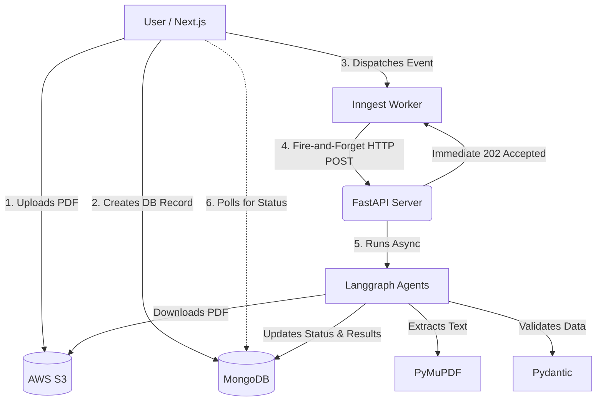

# Resumarq 🚀

**AI-Powered Resume & Job Description Analyzer for Students and Professionals**

Resumarq is an intelligent platform designed for students, job seekers, and professionals who want to critically evaluate their resumes. Whether you want to analyze your resume in isolation to identify general weak points or compare it directly against a specific Job Description (JD) to see exactly where you might be lacking, Resumarq provides deep, actionable insights to help you land your dream role.

---

## 🌐 Live Demo & Project Access

Want to see Resumarq in action? Check out the live platform and example analysis reports:
- **Live Platform**: [https://resumarq.vercel.app/](https://resumarq.vercel.app/) 
- **Demo Analysis Report**: You'll find 'View Interactive Demo' option for Demo.

---

## 📖 What is Resumarq?

The job market is highly competitive, and candidates often struggle to understand why their resume isn't passing ATS (Applicant Tracking Systems) or catching a recruiter's eye. Resumarq solves this by acting as an AI mentor. 

Users upload their resume (and optionally, a target JD), and the platform runs a comprehensive analysis to highlight missing keywords, weak bullet points, formatting issues, and overall alignment with the job requirements.

---

## 🏗️ Detailed Architecture & Scalability

Building an AI platform that performs heavy LLM text analysis requires a meticulous approach to architecture. Synchronous API calls would lead to timeouts and a poor user experience. To solve this, Resumarq is built on a highly scalable, event-driven **"fire-and-forget"** architecture.

### How It Works:
1. **Upload & DB Initialization**: When a user submits an analysis request, the **Next.js** frontend securely uploads the Resume PDF directly to **AWS S3**. Next.js then creates a document in **MongoDB** with a `pending` status, storing the JD text and the S3 key.
2. **Event Dispatch (Inngest)**: Next.js fires an event to our **Inngest** worker. The worker updates the MongoDB status to `processing`.
3. **Fire and Forget**: The Inngest worker sends an HTTP POST request to our **FastAPI** backend, containing the analysis ID, S3 key, and JD text. FastAPI immediately returns a `202 Accepted` response. This non-blocking step ensures that neither the frontend nor Inngest times out waiting for the AI.
4. **Background Agent Workflows (Langgraph)**: FastAPI utilizes background tasks to execute a complex **Langgraph** workflow. The backend downloads the PDF from S3, parses the text using **PyMuPDF**, and routes the data through specialized LLM agents (e.g., skills match, impact metrics, formatting).
5. **Structured Outputs & Direct DB Write**: All data moving between the LLM and our system is strictly validated using **Pydantic**. Once the agents finish, the FastAPI server connects directly to MongoDB to save the analysis results and mark the status as `completed`.
6. **Polling & Results**: Meanwhile, the frontend actively polls the MongoDB database. As soon as the status flips to `completed`, the user's dashboard dynamically renders the actionable insights.

### Cloud Scalability on AWS
The architecture is designed to handle massive spikes in user traffic (e.g., during placement seasons). 
- **Decoupled Workloads:** By separating the web server from the background AI workers, a surge in web traffic won't crash the heavy AI processing pipeline.
- **Horizontal Scaling:** The FastAPI agent servers run on **AWS EC2 instances** behind an Application Load Balancer (ALB). If analysis traffic grows, Auto Scaling Groups (ASG) can spin up additional EC2 instances to process the background tasks in parallel, automatically spinning down when demand drops.

---

## 🛠️ Comprehensive Tech Stack

Resumarq leverages a modern, robust, and developer-friendly stack:

### Frontend (Client-Side)
- **Next.js**: Server-Side Rendering (SSR) and seamless API routing for a fast, SEO-friendly web app.
- **Tailwind CSS & Shadcn UI**: For building a beautiful, accessible, and highly responsive user interface.
- **Better Auth**: Providing secure, flexible, and modern authentication for users.
- **Razorpay**: Integrated payment gateway for handling premium feature subscriptions and analysis credits.

### Backend (Server-Side)
- **FastAPI**: A high-performance Python web framework running on **Uvicorn**, perfect for building async, concurrent APIs and handling background tasks.
- **Inngest**: Integrated into the Next.js ecosystem to manage reliable event dispatching and orchestrate the hand-off to our FastAPI server.

### AI & Data Processing
- **Langgraph**: Orchestrates the multi-agent LLM workflows, allowing the AI to think and process the resume in distinct, logical steps.
- **PyMuPDF**: A blazing-fast library used to extract clean, highly accurate text and metadata from user-uploaded PDFs.
- **Pydantic**: Enforces strict data types and schema validation, ensuring the LLM outputs exactly what the frontend expects.
- **MongoDB**: Our primary NoSQL database, serving as the central source of truth for user data and analysis statuses.

### Cloud & Infrastructure
- **AWS S3**: Secure, scalable object storage for user resumes.
- **AWS EC2**: Scalable compute capacity to run our intensive FastAPI/Langgraph agent servers.

---

## 🚀 Getting Started

The project is divided into two primary services. For specific setup, environment variables, and local run instructions, please refer to the inner documentation:

- 🖥️ **[Frontend Web App (Next.js)](./web/README.md)**
- ⚙️ **[Agent Server (FastAPI)](./agent-server/README.md)**
