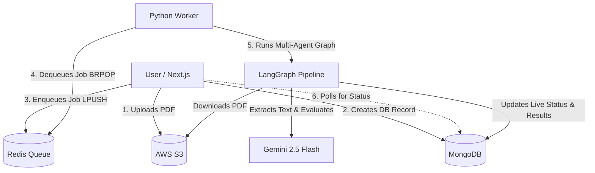

# Resumarq 🚀

**AI-Powered Resume & Job Description Analyzer for Students and Professionals**

Resumarq is an intelligent platform designed for students, job seekers, and professionals who want to critically evaluate their resumes. Whether you want to analyze your resume in isolation to identify general weak points or compare it directly against a specific Job Description (JD) to see exactly where you might be lacking, Resumarq provides deep, actionable insights to help you land your dream role.

---

## 🌐 Live Demo & Project Access

Want to see Resumarq in action? Check out the live platform and example analysis reports:
- **Live Platform**: [https://resumarq.vercel.app/](https://resumarq.vercel.app/) 
- **Demo Analysis Report**: You'll find 'View Interactive Demo' option for Demo.

---

## 📖 What is Resumarq?

The job market is highly competitive, and candidates often struggle to understand why their resume isn't passing ATS (Applicant Tracking Systems) or catching a recruiter's eye. Resumarq solves this by acting as an AI mentor. 

Users upload their resume (and optionally, a target JD), and the platform runs a comprehensive analysis to highlight missing keywords, weak bullet points, formatting issues, and overall alignment with the job requirements.

---

## 🏗️ Detailed Architecture & Scalability

Building an AI platform that performs heavy LLM text analysis requires a meticulous approach to architecture. Synchronous API calls would lead to timeouts and poor user experience. To solve this, Resumarq is built on an event-driven **Redis Queue + Distributed Worker** architecture.

```mermaid
graph TD
    A[User / Next.js] -->|1. Uploads PDF| C[(AWS S3)]
    A -->|2. Creates DB Record| H[(MongoDB)]
    A -->|3. Enqueues Job LPUSH| D[(Redis Queue)]
    A -.->|6. Polls for Status| H
    
    E[Python Worker] -->|4. Dequeues Job BRPOP| D
    E -->|5. Runs Multi-Agent Graph| G[LangGraph Pipeline]
    G -->|Downloads PDF| C
    G -->|Extracts Text & Evaluates| F[Gemini 2.5 Flash]
    G -->|Updates Live Status & Results| H
```

### How It Works:
1. **Upload & DB Initialization**: When a user submits an analysis request, the **Next.js** frontend securely uploads the Resume PDF directly to **AWS S3**. Next.js then creates a document in **MongoDB** with a `pending` status, storing the JD text and the S3 key.
2. **Job Enqueue (Redis)**: Next.js enqueues the job payload (`analysisId`, `resumeS3Key`, `jdText`) directly into **Redis** (`resumarq:jobs` queue) and immediately returns `201 Created` to the client.
3. **Queue Backpressure & Concurrency**: The background **Python Worker** (`worker.py`) constantly listens to the Redis queue using non-blocking `BRPOP`. Workers only dequeue jobs when concurrency slots (`asyncio.Semaphore`) are free, preventing server overload.
4. **Multi-Agent Execution (LangGraph)**: The worker executes the LangGraph multi-agent pipeline. It fetches the resume from S3, parses candidate and JD profiles, audits ATS rules, checks quantifiable impact, conducts company research with Google grounding, and critiques findings.
5. **Real-time Status Updates & MongoDB Persistence**: As the graph streams through each node, it updates MongoDB in real-time (`extracting_data`, `analyzing_ats`, `evaluating_impact`, `researching_company`, `compiling_report`). Upon completion, the full validated report is saved to MongoDB.
6. **Polling & Dynamic UI**: The frontend polls MongoDB. As each milestone completes, the user's dashboard dynamically renders live progress and final actionable insights.

### Cloud Scalability on AWS
The architecture is designed to handle massive spikes in user traffic (e.g., during placement seasons). 
- **Decoupled Workloads:** The Next.js web application is completely decoupled from the AI processing workers via Redis.
- **Horizontal Scaling:** Workers run as lightweight background services on **AWS EC2 instances**. You can scale from 1 worker to dozens across multiple EC2 instances, all pulling from the same Redis queue without code changes.

---

## 🛠️ Comprehensive Tech Stack

Resumarq leverages a modern, robust, and developer-friendly stack:

### Frontend (Client-Side)
- **Next.js**: Server-Side Rendering (SSR) and App Router API routes.
- **Tailwind CSS & Shadcn UI**: Clean, responsive design system.
- **Better Auth**: Providing secure, flexible authentication.
- **Razorpay**: Integrated payment gateway for feature subscriptions and analysis credits.
- **ioredis**: Ultra-fast, resilient Redis client for background job enqueuing.

### Backend (AI Worker & Monitoring)
- **Python Redis Worker**: Async background consumer (`worker.py`) with concurrency control and graceful shutdown.
- **FastAPI**: Lightweight health check and queue monitoring service.
- **LangGraph**: Orchestrates the multi-agent LLM workflows in distinct, structured tiers.
- **PyMuPDF**: Fast PDF text extraction and inspection.
- **Pydantic**: Strict data validation and structured outputs for LLMs.
- **Motor / MongoDB**: Async MongoDB database for user data and analysis persistence.

### Cloud & Infrastructure
- **Redis (Redis Cloud / ElastiCache)**: Reliable, high-throughput job queue.
- **AWS S3**: Secure, scalable object storage for resume PDFs.
- **AWS EC2**: Compute capacity for Python worker services and AI pipeline.

---

## 🚀 Getting Started

The project is divided into two primary services. For specific setup, environment variables, and local run instructions, please refer to the inner documentation:

- 🖥️ **[Frontend Web App (Next.js)](./web/README.md)**
- ⚙️ **[Agent Server & Worker (Python)](./agent-server/README.md)**
